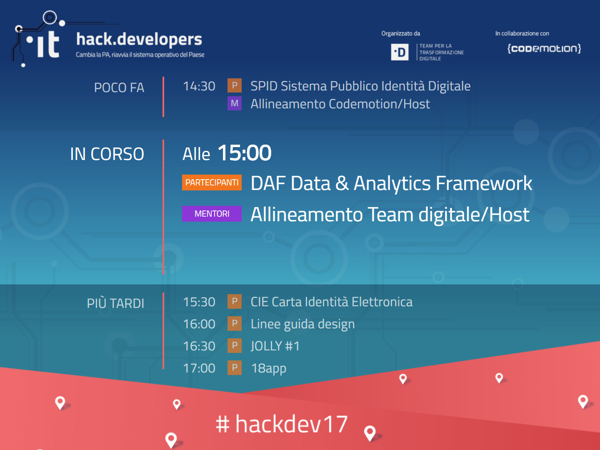

# Agenda di Hack Developers Italia
Questa pagina web visualizza gli orari e le sessioni in agenda. Può essere proiettata nel corso dell'hackathon per tenere informati i partecipanti. La pagina non necessita di refresh: i contenuti si aggiorneranno automaticamente, anche nel caso in cui l'agenda cambi nel corso della manifestazione. Mi occuperò io stesso di tenerla aggiornata.

La pagina è disponibile al seguente indirizzo: [https://brightsoul.github.io/](https://brightsoul.github.io/)

In alternativa, è ovviamente possibile scaricare i file ed ospitarli su un proprio webserver locale.

Per provare il funzionamento della pagina, modificate l'orologio del vostro PC al 7 ottobre alle 15:00.

### Opzioni
E' possibile invocare la pagina fornendo dei parametri querystring per configurarne il comportamento.
 * Parametro *width* per impostare una larghezza percentuale o in pixel diversa da quella di default (utile per adattare la pagina alla vostra risoluzione);
 * Parametro *lang* per impostare la lingua it o en.
 
 Esempio: [https://brightsoul.github.io/?width=100%&lang=en](https://brightsoul.github.io/?width=100%&lang=en)
 
 In questo esempio, la pagina occuperà tutto lo spazio disponibile (deformando un po' la grafica di sfondo) e i testi verranno visualizzati in inglese.
 

 
